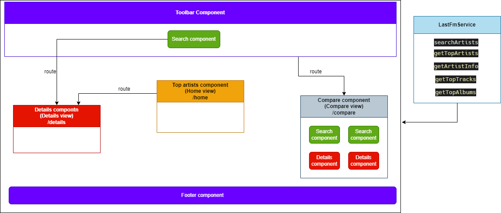

# LastFM-WebApp

## Overview
This Angular web application uses the last.fm api to show different information about musical artists. The application is built using Angular, HTML, CSS, and Typescript.

Note: since last.fm API doesn't provide images of the artists or tracks anymore (only a star sign), I created a list of local image files for some artists for demonstration. Images for albums are thankfully provided in the API.

## Demo
To showcase the features mentioned below, a live demonstration of the app can be found at 
### https://anas9244.github.io/LastFM-WebApp/

Just in case, video demonstration about the different views of the app can be found at:
https://drive.google.com/drive/folders/1zHT3jUK4RJwGVaf1nXWsujwnBcPojg3q?usp=share_link

## Structure and components:
The following diagram shows the structure of the app:

### Search Component 
Used in Toolbar Component and in Compare Component. It includes an input and an autocomplete element.
- When used in Toolbar Component:
Clicking on one of the found artists redirects the view to the details component
- when used in Compare Component: 
triggers the details component in compare component to be initialized
### Toolbar Component
Used in the main app component to make it visible throughout the app. Includes a toolbar fixed at the top of the application, that has a title, an instance of the Search Component and a button to navigate to Compare Component.
### TopArtists Component
Used as a stand-alone component. Represents the main view of the app (Home). Includes a list of the top ten artists in a country chosen from a select element at the top of the component.  
### Details Component
Used as a stand alone component and in Compare component. Includes a banner image of the artist and other information
### LastFmService
Has 5 main  functions to fetch data required by the components.

## Features

#### Modularity and component reusability
Instances of Search and detail components were used in toolbar and compare with little to no changes in the template or class of both components.
#### Responsiveness
The app was designed so that it can be adapted on different screen sizes, to make the usage of the app consistent in all cases and limit or eliminate the need for unwanted scrolling
Some examples include:
- making sure the search field in toolbar stays wide enough by shrinking or relocating the neighboring elements (compare button as floating button)
- fitting card lists/grids elements to the width of the screen to avoid scrolling
- text resizing or relocating (in the case of details view)
- see demo for more
#### Resume working after offline
The app can resume working after connection has been lost and stable again without needing to refresh the page.
#### Consistent theming and modern material design
To achieve enjoyable experience and useability, some of the most important design standards and guidelines were considered including:
- colors and graphic simplicity
- visual hierarchy: arranging and organizing the elements so that visitors naturally gravitate toward the most important elements first
- Conventionality: some of the most important web design conventions were met including:
* Placing a logo at the top left (or center) of a page
* Making the logo clickable, so it always brings a visitor back to the homepage.
* Having buttons that change color/appearance when you hover over them.
* Typography: texts are easily legible and readable, even over image (ex. Details view with a black gradient on the banner)